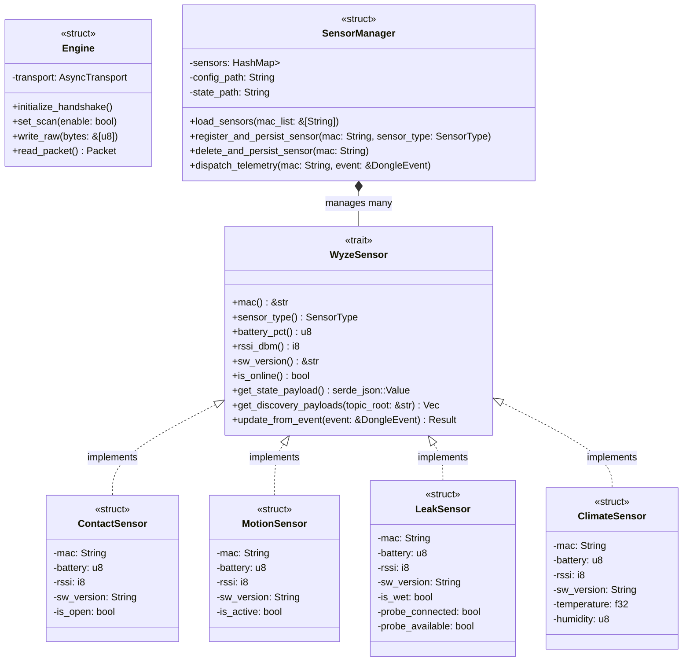

# Wyze Sense to MQTT Bridge (Rust): System Architecture & Design Specification

This document defines the architecture, component interactions, and design patterns of **Wyze Sense to MQTT Bridge (Rust)** (formerly `WyzeSenseRS`), a high-performance, asynchronous USB-to-MQTT gateway for Wyze Sense (V1/V2) sensors compiled in Rust.

---

## 1. Core Architectural Blueprint

Due to Linux kernel restrictions, only a single process can open the USB HID device `/dev/hidrawX` at any given time. To prevent conflict between the Web Dashboard, the background MQTT broker gateway, and diagnostic CLI tools, the **Wyze Sense to MQTT Bridge (Rust)** uses a **Unified Target Architecture** compiled into a single binary.

```
               Wyze Sense to MQTT Bridge (Rust) (Single Process)
        +------------------------------------------------------------------------------+
        |                                                                              |
        |   +-----------------------+  +-----------------------+  +----------------+   |
        |   |   Axum Web UI Task    |  |  MQTT Gateway Task    |  |  CLI Client    |   |
        |   | (REST Server: port)   |  |  (rumqttc Publisher)  |  |  Subcommand    |   |
        |   +-----------+-----------+  +-----------+-----------+  +-------+--------+   |
        |               |                          |                      |            |
        |               +-------------+------------+                      | (HTTP API) |
        |                             |                                   |            |
        |                             v                                   |            |
        |                    +--------+--------+                          |            |
        |                    |  Engine Actor   | <------------------------+            |
        |                    | (Arc<Mutex<E>>) |                                       |
        |                    +--------+--------+                                       |
        |                             |                                                |
        |                             v                                                |
        |                    +--------+--------+                                       |
        |                    |  USB hidraw0    |                                       |
        |                    +-----------------+                                       |
        |                                                                              |
        +------------------------------------------------------------------------------+
```

### 1.1 Execution Modes
1.  **Daemon Mode (Default)**:
    *   Booted by running `wyzesense2mqtt-rs` without subcommands.
    *   Instantiates the core asynchronous USB `Engine`.
    *   Performs a 5-step cryptographic/protocol handshake to unlock the dongle.
    *   Spawns a background Axum Web REST server and beautiful embedded Single-Page console.
    *   Spawns a background `rumqttc` MQTT Gateway task, managing topics, status reports, and Home Assistant Auto-Discovery.
    *   Spawns the background `AvailabilityMonitor` to sweep timeouts and persist states.

2.  **CLI Subcommand Client Mode**:
    *   Booted by appending subcommands (e.g. `wyzesense2mqtt-rs list`, `pair`, `unpair <mac>`, `chime <mac>`, `fix`, `raw <hex>`).
    *   **Daemon REST Routing (Primary)**: The CLI queries `http://127.0.0.1:[PORT]` to check if a local daemon is running. If active, the CLI issues a REST call to execute the command instantly, avoiding USB locks.
    *   **Direct HID Fallback (Secondary)**: If the daemon is offline, the CLI opens `/dev/hidrawX` directly to execute the command offline, closing the interface immediately upon completion.

---

## 2. Object-Oriented & Polymorphic Crate Design

Modeling diverse physical sensors (e.g., a Contact sensor has boolean state, while a Climate sensor reports temperature and humidity) requires a flexible polymorphic design. We implement this using Rust's **Trait-based Polymorphic System** rather than subclassing.

### 2.1 Class Diagram



### 2.2 The `WyzeSensor` Trait
The `WyzeSensor` trait defines a common interface for metadata acquisition, telemetry parsing, state mapping, and Home Assistant Auto-Discovery registration:

```rust
pub trait WyzeSensor: Send + Sync {
    fn mac(&self) -> &str;
    fn sensor_type(&self) -> SensorType;
    fn battery_pct(&self) -> u8;
    fn rssi_dbm(&self) -> i8;
    fn sw_version(&self) -> &str;
    fn is_online(&self) -> bool;
    
    // Dynamic JSON representation of states for MQTT publishing
    fn get_state_payload(&self) -> serde_json::Value;

    // Home Assistant discovery configurations mapping
    fn get_discovery_payloads(&self, topic_root: &str) -> Vec<(String, serde_json::Value)>;

    // Update internal sensor state variables from standard parsed events
    fn update_from_event(&mut self, event: &DongleEvent) -> Result<(), &'static str>;
}
```

### 2.3 How we Solve Diverse Attribute Representation
*   **Compile-Time Safety**: Inside concrete structs (`ContactSensor`, `ClimateSensor`), properties are strongly-typed (e.g. `is_open: bool` or `temperature: f32`).
*   **Standardized Serialization**: By exposing `get_state_payload() -> serde_json::Value`, the `SensorManager` and MQTT adapters fetch a dynamic JSON dictionary representation. They can serialize and publish updates without needing to understand individual sensor fields.
*   **Discovery Decoupling**: Concrete structs generate their own MQTT Auto-Discovery templates. A `ClimateSensor` registers two entities (`temperature` and `humidity`), while a `LeakSensor` registers `moisture` and `probe` binary sensors. The coordinator publishes whatever vector the sensor generates.

---

## 3. State Management & Recovery
1.  **Bootstrap and NVRAM Sync**:
    *   At startup, the `Engine` retrieves the physical paired MAC address list stored in the USB dongle's NVRAM.
    *   `SensorManager` cross-references this list with local file configurations (`config/sensors.yaml`), populating the dynamic polymorphic cache using `SensorFactory::create`.
2.  **Atomic State Saving**:
    *   The system state (`config/state.yaml`) tracks live status metrics (e.g., last seen time, battery, rssi).
    *   All disk serialization writes are executed **atomically** (writing to a `.tmp` file and swapping it via `rename` syscalls) to guarantee no corruption occurs during power outages.
