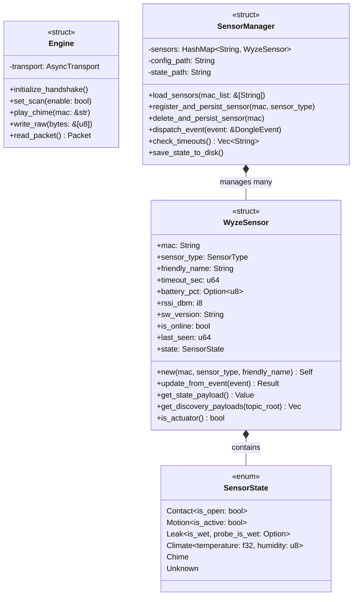

# Wyze Sense to MQTT Bridge (Rust): System Architecture & Design Specification

This document defines the architecture, component interactions, and design patterns of **Wyze Sense to MQTT Bridge (Rust)** (formerly `WyzeSenseRS`), a high-performance, asynchronous USB-to-MQTT gateway for Wyze Sense (V1/V2) sensors compiled in Rust.

---

## 1. Core Architectural Blueprint

Due to Linux kernel restrictions, only a single process can open the USB HID device `/dev/hidrawX` at any given time. To prevent conflict between the Web Dashboard, the background MQTT broker gateway, and diagnostic CLI tools, the **Wyze Sense to MQTT Bridge (Rust)** uses a **Unified Target Architecture** compiled into a single binary.

```
               Wyze Sense to MQTT Bridge (Rust) (Single Process)
        +------------------------------------------------------------------------------+
        |                                                                              |
        |   +-----------------------+  +-----------------------+  +----------------+   |
        |   |   Axum Web UI Task    |  |  MQTT Gateway Task    |  |  CLI Client    |   |
        |   | (REST Server: port)   |  |  (rumqttc Publisher)  |  |  Subcommand    |   |
        |   +-----------+-----------+  +-----------+-----------+  +-------+--------+   |
        |               |                          |                      |            |
        |               +-------------+------------+                      | (HTTP API) |
        |                             |                                   |            |
        |                             v                                   |            |
        |                    +--------+--------+                          |            |
        |                    |  Engine Actor   | <------------------------+            |
        |                    | (Arc<Mutex<E>>) |                                       |
        |                    +--------+--------+                                       |
        |                             |                                                |
        |                             v                                                |
        |                    +--------+--------+                                       |
        |                    |  USB hidraw0    |                                       |
        |                    +-----------------+                                       |
        |                                                                              |
        +------------------------------------------------------------------------------+
```

### 1.1 Execution Modes
1.  **Daemon Mode (Default)**:
    *   Booted by running `wyzesense2mqtt-rs` without subcommands.
    *   Instantiates the core asynchronous USB `Engine`.
    *   Performs a 5-step cryptographic/protocol handshake to unlock the dongle.
    *   Spawns a background Axum Web REST server and beautiful embedded Single-Page console.
    *   Spawns a background `rumqttc` MQTT Gateway task, managing topics, status reports, and Home Assistant Auto-Discovery.
    *   Spawns the background `AvailabilityMonitor` to sweep timeouts and persist states.

2.  **CLI Subcommand Client Mode**:
    *   Booted by appending subcommands (e.g. `wyzesense2mqtt-rs list`, `pair`, `unpair <mac>`, `chime <mac>`, `fix`, `raw <hex>`).
    *   **Daemon REST Routing (Primary)**: The CLI queries `http://127.0.0.1:[PORT]` to check if a local daemon is running. If active, the CLI issues a REST call to execute the command instantly, avoiding USB locks.
    *   **Direct HID Fallback (Secondary)**: If the daemon is offline, the CLI opens `/dev/hidrawX` directly to execute the command offline, closing the interface immediately upon completion.

---

## 2. Sensor Device Model: Composition with Enum-Based State

Wyze Sense devices include diverse sensors (Contact, Motion, Leak, Climate) and actuators (Chime). Rather than trait-based polymorphism with separate structs per type, the system uses a **unified struct + tagged enum** design. This cleanly separates the uniform parts (identity, common telemetry) from the polymorphic part (type-specific state).

### 2.1 Design Principles

*   **Config is uniform, state is polymorphic.** All devices share the same identity fields (MAC, name, timeout) and common telemetry (rssi, online status). Only the type-specific state varies.
*   **Closed type set → enum, not trait.** The set of device types is known at compile time, making an enum more idiomatic and performant than `Box<dyn Trait>` dispatch.
*   **Sensors and actuators coexist.** The Chime is an actuator (receives commands, doesn't report telemetry state) but shares enough infrastructure (MAC, pairing lifecycle, NVRAM slot) to live in the same unified struct. `SensorState::Chime` simply has no data fields.

### 2.2 Class Diagram



### 2.3 The `SensorState` Enum

The `SensorState` enum is the **only part that varies** between device types. It derives `Serialize`/`Deserialize` for direct persistence to `state.yaml`, using a tagged representation:

```rust
#[derive(Debug, Clone, Serialize, Deserialize, PartialEq)]
#[serde(tag = "kind")]
pub enum SensorState {
    Contact { is_open: bool },
    Motion { is_active: bool },
    Leak {
        is_wet: bool,
        probe_is_wet: Option<bool>,  // None = no probe, Some(true) = wet, Some(false) = dry
    },
    Climate {
        temperature: f32,
        humidity: u8,
    },
    Chime,      // Actuator: no inbound telemetry, receives play_chime commands
    Unknown,
}
```

### 2.4 How We Solve Diverse Attribute Representation

*   **Compile-Time Safety**: Type-specific state lives in the `SensorState` enum variants with strongly-typed fields (e.g. `is_open: bool`, `temperature: f32`). Invalid states are unrepresentable.
*   **Standardized Serialization**: `get_state_payload() → serde_json::Value` produces a dynamic JSON dictionary by merging common fields with a `match` on `self.state`. The MQTT gateway publishes whatever the sensor produces without knowing its internals.
*   **Discovery Decoupling**: `get_discovery_payloads()` matches on `self.state` to generate type-appropriate HASS entities. A `Climate` sensor registers `temperature` and `humidity` entities. A `Chime` registers a `button` entity. The coordinator publishes whatever vector the sensor generates.
*   **Actuator Support**: The Chime device fits naturally as `SensorState::Chime` — `update_from_event()` is a no-op, `get_state_payload()` returns `"idle"`, and `get_discovery_payloads()` registers a HASS button entity. `battery_pct` is `None` since Chime is mains-powered.

---

## 3. Configuration & State Management

### 3.1 Config vs. State Separation

The system maintains two YAML files with clearly separated responsibilities:

| File | Purpose | Editable by | Authority |
|---|---|---|---|
| `config/sensors.yaml` | Human preferences | Human + code (append-only for new entries) | Name, timeout |
| `config/state.yaml` | Runtime state cache | Code only | Sensor type, battery, rssi, type-specific state |

**`sensors.yaml`** — User preferences (name overrides, custom timeouts):
```yaml
sensors:
  77C68193:
    name: "Kitchen Climate"
    timeout_sec: 1800
  77A8C793:
    name: "Living Room Motion"
```

**`state.yaml`** — Code-managed runtime state with full type-specific persistence:
```yaml
sensors:
  77C68193:
    mac: 77C68193
    sensor_type: climate
    version: unknown
    last_seen: 1780121193
    battery: 95
    signal: -43
    state:
      kind: Climate
      temperature: 22.50
      humidity: 45
  77C99999:
    mac: 77C99999
    sensor_type: chime
    version: unknown
    last_seen: 1780121000
    battery: null
    signal: -50
    state:
      kind: Chime
```

### 3.2 Type Authority & Load Priority

Sensor type is determined by the hardware protocol, not human choice. The load priority is:

```
sensor_type:    state.yaml (authoritative) > sensors.yaml (migration hint) > "unknown"
friendly_name:  sensors.yaml > auto-generated default
timeout_sec:    sensors.yaml > type-based default
```

### 3.3 Bootstrap and NVRAM Sync

1.  At startup, the `Engine` retrieves the physical paired MAC address list stored in the USB dongle's NVRAM.
2.  `SensorManager` cross-references this list with `state.yaml` (for type and cached state) and `sensors.yaml` (for name/timeout preferences), constructing `WyzeSensor` instances directly via `WyzeSensor::new()`.
3.  Full type-specific state is restored from `state.yaml` — no synthetic event generation needed.

### 3.4 Atomic State Saving

All disk serialization writes are executed **atomically** (writing to a `.tmp` file and swapping it via `rename` syscalls) to guarantee no corruption occurs during power outages.

### 3.5 Backward Compatibility

*   Old `state.yaml` files without a `state` field deserialize with `SensorState::Unknown` as default (via `#[serde(default)]`).
*   Old `sensors.yaml` files with a `type` field still parse correctly — the field is `Option<String>` and used only as a migration hint when `state.yaml` has no entry for that MAC.
*   Old `state.yaml` files with `battery: 100` (integer) correctly deserialize into `Some(100)` via a `#[serde(default)]` fallback.
