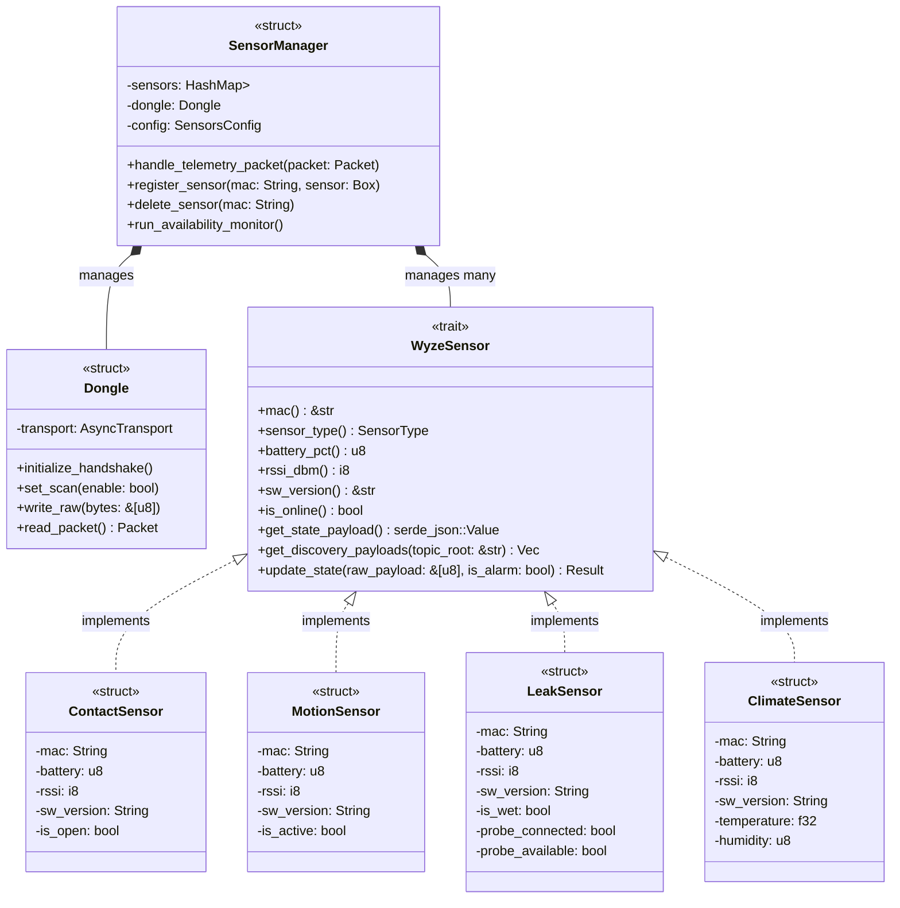

# Wyze Sense to MQTT Bridge (Rust): Object-Oriented Refactoring Design

This document outlines the architectural blueprint for refactoring **Wyze Sense to MQTT Bridge (Rust)** from a legacy Python-mapped structure into an idiomatic, type-safe, and modular Object-Oriented Design (OOD) utilizing Rust's trait-based polymorphic system.

---

## Architectural Overview

Rather than relying on traditional subclassing (which Rust does not support), this design uses **Traits** to define interfaces, **concrete Structs** to encapsulate sensor-specific state and logic, and a centralized **SensorManager** for coordination.



---

## Core Components

### 1. The `WyzeSensor` Interface (Trait)

In Rust, interfaces are represented as **Traits**. To accommodate different sensors having different attributes (e.g., Contact has `is_open`, Climate has `temperature` and `humidity`), we combine **compile-time type safety** inside the struct with **runtime dynamic serialization** using `serde_json::Value` when interacting with external systems like MQTT or Home Assistant.

```rust
use serde_json::Value;

pub trait WyzeSensor: Send + Sync {
    // Common metadata getters
    fn mac(&self) -> &str;
    fn sensor_type(&self) -> SensorType;
    fn battery_pct(&self) -> u8;
    fn rssi_dbm(&self) -> i8;
    fn sw_version(&self) -> &str;
    fn is_online(&self) -> bool;

    // Dynamic JSON serialization of state for external use (e.g., MQTT payload)
    fn get_state_payload(&self) -> Value;

    // Home Assistant Discovery Topics and Configuration payloads
    fn get_discovery_payloads(&self, topic_root: &str) -> Vec<(String, Value)>;

    // Parses raw protocol bytes to update internal state fields
    fn update_state(&mut self, raw_payload: &[u8], is_alarm: bool) -> Result<(), &'static str>;
}
```

---

### 2. Sensor Implementations (Concrete Structs)

Each physical sensor type encapsulates its own fields statically.

#### A. `ContactSensor`
```rust
pub struct ContactSensor {
    mac: String,
    battery_pct: u8,
    rssi_dbm: i8,
    sw_version: String,
    is_online: bool,
    is_open: bool,
}

impl WyzeSensor for ContactSensor {
    // ... getters ...

    fn get_state_payload(&self) -> Value {
        serde_json::json!({
            "battery": self.battery_pct,
            "online": self.is_online,
            "state": if self.is_open { "open" } else { "closed" },
            "signal_strength": self.rssi_dbm,
            "sw_version": self.sw_version,
        })
    }

    fn get_discovery_payloads(&self, topic_root: &str) -> Vec<(String, Value)> {
        // Returns HASS binary_sensor discovery topics & configs
    }
}
```

#### B. `ClimateSensor`
```rust
pub struct ClimateSensor {
    mac: String,
    battery_pct: u8,
    rssi_dbm: i8,
    sw_version: String,
    is_online: bool,
    temperature: f32,
    humidity: u8,
}

impl WyzeSensor for ClimateSensor {
    // ... getters ...

    fn get_state_payload(&self) -> Value {
        serde_json::json!({
            "battery": self.battery_pct,
            "online": self.is_online,
            "temperature": format!("{:.2}", self.temperature),
            "humidity": self.humidity,
            "signal_strength": self.rssi_dbm,
            "sw_version": self.sw_version,
        })
    }

    fn get_discovery_payloads(&self, topic_root: &str) -> Vec<(String, Value)> {
        // Returns HASS temperature and humidity sensor discovery configs
    }
}
```

---

### 3. The `Dongle` (Communication Abstraction)

Encapsulates serial read/write transport and low-level packet frames.

```rust
pub struct Dongle<T: AsyncTransport> {
    transport: T,
    mac: Option<String>,
    version: Option<String>,
}

impl<T: AsyncTransport> Dongle<T> {
    pub async fn initialize_handshake(&mut self) -> Result<(), std::io::Error>;
    pub async fn set_scan(&mut self, enable: bool) -> Result<(), std::io::Error>;
    pub async fn read_packet(&mut self) -> Result<Packet, std::io::Error>;
    pub async fn write_packet(&mut self, pkt: &Packet) -> Result<(), std::io::Error>;
}
```

---

### 4. The `SensorManager` (Coordinator) & `SensorFactory`

Manages active sensors and acts as the dispatcher. Since different sensors are stored under a single list, we use Rust's **Trait Objects (`Box<dyn WyzeSensor>`)** for dynamic dispatch.

To resolve the challenge where the USB dongle does not report sensor types during telemetry updates, all sensors are either:
1. **Bootstrapped (Loaded)** from the configuration files at startup.
2. **Dynamically Paired** and committed both in-memory and persistently to the configuration file.

```rust
use std::collections::HashMap;
use serde_json::Value;

pub struct SensorFactory;

impl SensorFactory {
    /// Instantiates the correct dynamic implementation of the WyzeSensor trait based on type string.
    pub fn create(
        mac: String,
        sensor_type: &str,
        battery: u8,
        rssi: i8,
        sw_version: String,
    ) -> Result<Box<dyn WyzeSensor>, String> {
        match sensor_type {
            "contact" => Ok(Box::new(ContactSensor::new(mac, battery, rssi, sw_version))),
            "motion" => Ok(Box::new(MotionSensor::new(mac, battery, rssi, sw_version))),
            "leak" => Ok(Box::new(LeakSensor::new(mac, battery, rssi, sw_version))),
            "climate" => Ok(Box::new(ClimateSensor::new(mac, battery, rssi, sw_version))),
            _ => Err(format!("Unknown sensor type: {}", sensor_type)),
        }
    }
}

pub struct SensorManager {
    sensors: HashMap<String, Box<dyn WyzeSensor>>,
    dongle: Dongle<HidrawTransport>,
    config_path: String,
}

impl SensorManager {
    /// Bootstrap: Loads all previously registered/paired sensors from the YAML configuration file on boot.
    pub fn load_sensors(&mut self) -> Result<(), Box<dyn std::error::Error>> {
        let config = SensorsConfig::load_from_yaml(&self.config_path)?;
        for (mac, metadata) in config.sensors {
            let sensor = SensorFactory::create(
                mac.clone(),
                &metadata.r#type,
                100,            // Default initial battery
                -60,           // Default initial RSSI
                String::new(), // Empty initial sw_version (fetched dynamically later)
            )?;
            self.sensors.insert(mac, sensor);
        }
        Ok(())
    }

    /// Pairing: Registers a newly paired sensor in-memory and persists its MAC & Type back to config.yaml.
    /// Gracefully handles re-pairing by preserving any pre-existing custom metadata (like custom names or timeouts).
    pub fn register_and_persist_sensor(
        &mut self,
        mac: String,
        sensor_type: &str,
    ) -> Result<(), Box<dyn std::error::Error>> {
        // 1. Load existing configurations
        let mut config = SensorsConfig::load_from_yaml(&self.config_path).unwrap_or_else(|_| SensorsConfig {
            sensors: HashMap::new(),
        });

        // 2. Determine settings: preserve existing custom metadata if re-pairing
        let (name, timeout_sec) = if let Some(existing) = config.sensors.get(&mac) {
            (
                existing.name.clone(),
                existing.timeout_sec.unwrap_or(1800),
            )
        } else {
            (
                format!("Wyze Sensor {}", &mac[mac.len() - 4..]),
                1800,
            )
        };

        // 3. Construct and insert the in-memory sensor object with preserved settings
        let sensor = SensorFactory::create(
            mac.clone(),
            sensor_type,
            100,
            -60,
            String::new(),
        )?;
        self.sensors.insert(mac.clone(), sensor);

        // 4. Update metadata in the config (preserving custom attributes, updating type)
        config.sensors.insert(mac, SensorMetadata {
            name,
            r#type: sensor_type.to_string(),
            timeout_sec: Some(timeout_sec),
        });

        // 5. Atomically save configuration changes back to disk
        config.save_to_yaml_atomic(&self.config_path)?;

        Ok(())
    }

    /// Routes incoming raw telemetry frames from the dongle to the corresponding sensor
    pub fn dispatch_telemetry(&mut self, mac: &str, payload: &[u8], is_alarm: bool) {
        if let Some(sensor) = self.sensors.get_mut(mac) {
            if let Err(e) = sensor.update_state(payload, is_alarm) {
                eprintln!("Failed to update sensor state: {}", e);
            }
        } else {
            println!("Telemetry received for unmanaged sensor: {}", mac);
        }
    }

    /// Periodically sweep all registered sensors to verify availability timeouts
    pub fn check_timeouts(&mut self) {
        // Checks timeout_sec configuration and marks sensors offline
    }
}
```

---

## Resolving the "Different Attributes" Dilemma

In Python, dynamic properties are handled using dictionary keys, making it easy to query `sensor["temperature"]` but highly prone to runtime crashes (e.g. `KeyError` or `NoneType` access).

In Rust, we solve this gracefully via:
1. **Compile-Time Safety:** Inside concrete structs (`ContactSensor`, `ClimateSensor`, etc.), attributes are strongly typed (e.g. `is_open: bool` or `temperature: f32`). Code interacting with a contact sensor can never accidentally read temperature.
2. **Standardized Serialization:** Through `get_state_payload(&self) -> serde_json::Value`, the trait allows the manager to get a dynamic, JSON-serializable dictionary representation. The manager or MQTT publisher doesn't need to know *what* attributes exist; it simply serializes whatever JSON dictionary the sensor returns.
3. **Home Assistant Decoupling:** Discovery payloads are generated internally by the sensor type itself. A `ClimateSensor` knows it needs to register two separate Home Assistant entities (`temperature` and `humidity`), while a `LeakSensor` knows it registers `moisture` and `probe` entities. The manager simply requests the discovery vector and publishes it.
